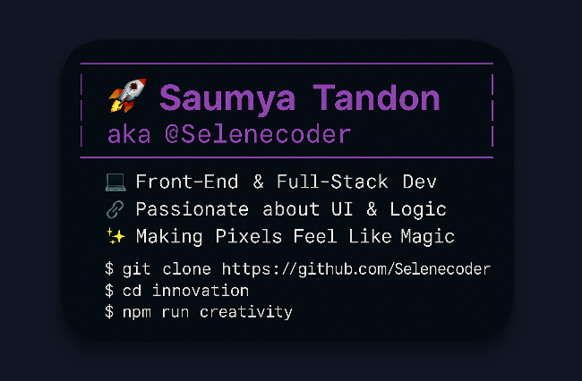

<!-- 👆 Banner image -->

  

# 👋 Hi, I'm **Saumya Tandon** (aka `@Selenecoder`)

**💻 Front‑End & Web Developer | PHP + SQL Backend | Java Enthusiast**  
🎓 Computer Science Student • 📍 Ujjain, India • Pronouns: She/Her  
[📫 Connect on LinkedIn](https://www.linkedin.com/in/saumya-tandon-2824sau301) • tsaumya176@gmail.com

---

##  🔧 Tech Stack

### 🗣️ Languages

---

### 🧩 Frameworks / Libraries

---

### 🛠️ Tools & IDEs

---

## 🚀 Featured Projects

### 📊 [**VyaySigh – Smart Expense Tracker**](https://github.com/Selenecoder/expense-tracker)
Full-stack finance app: JWT auth, savings goals, charts. React + Spring Boot + Postgres.

### 🩺 [**MediBuddy – Healthcare Platform**](https://github.com/Selenecoder/Medi-buddy)
A responsive, dummy healthcare diagnostic site built using HTML, CSS, Bootstrap & PHP. Includes appointment booking simulation and clean modular structure.
A clean React/JS app to manage and filter expenses with add/edit/delete functionalities.

### 🛰️ [**Satellite Telemetry Simulator – Real-Time Dashboard**](https://github.com/Selenecoder/Satellite-Telemetry-Simulator)
Simulates satellite telemetry data with live charts, alerts, fullscreen view toggle, and CSV export. Built using Python and Streamlit.

---

## 🌟 Open Source & Achievements

- Contributor @ GirlScript Summer of Code 2024  
- Postman Student Expert  
- CTC Coding Club Co-Lead • MLA Workshops Organizer

---

## 🎭 Fun Facts

I’m an enthusiastic **dancer**, an engaged **MUNer**, and passionate about creating UIs that move both *pixels and people*.

---

### 🏅 Certifications

---

## 📈 GitHub Stats

